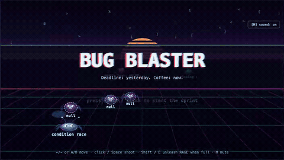
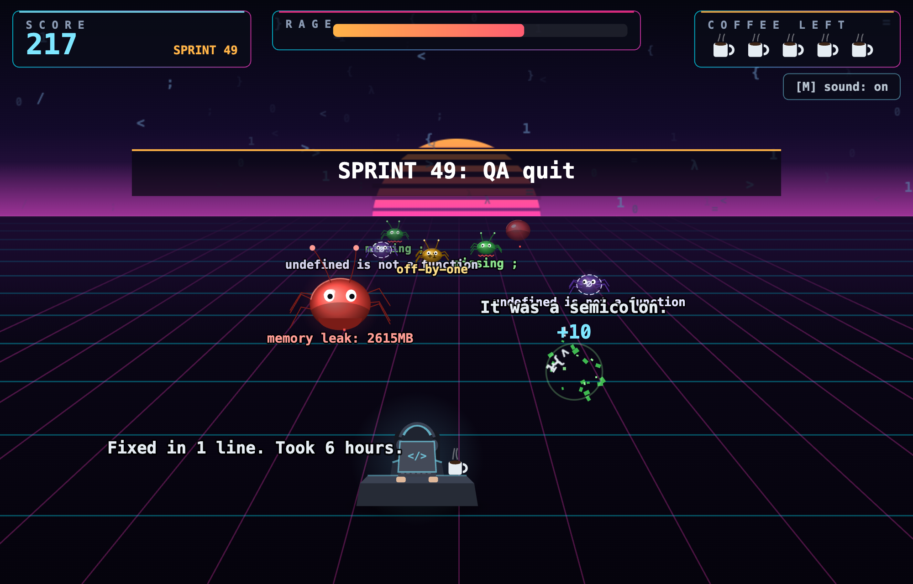
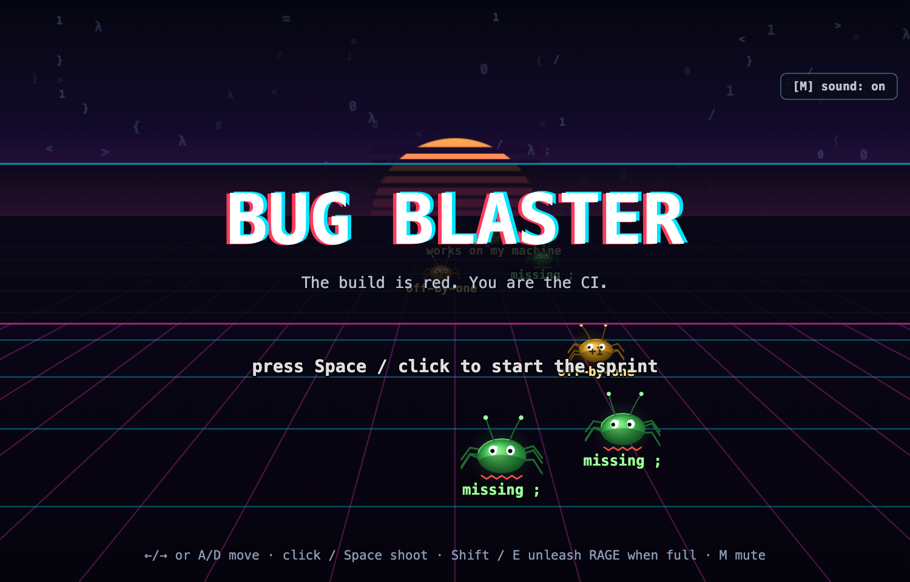
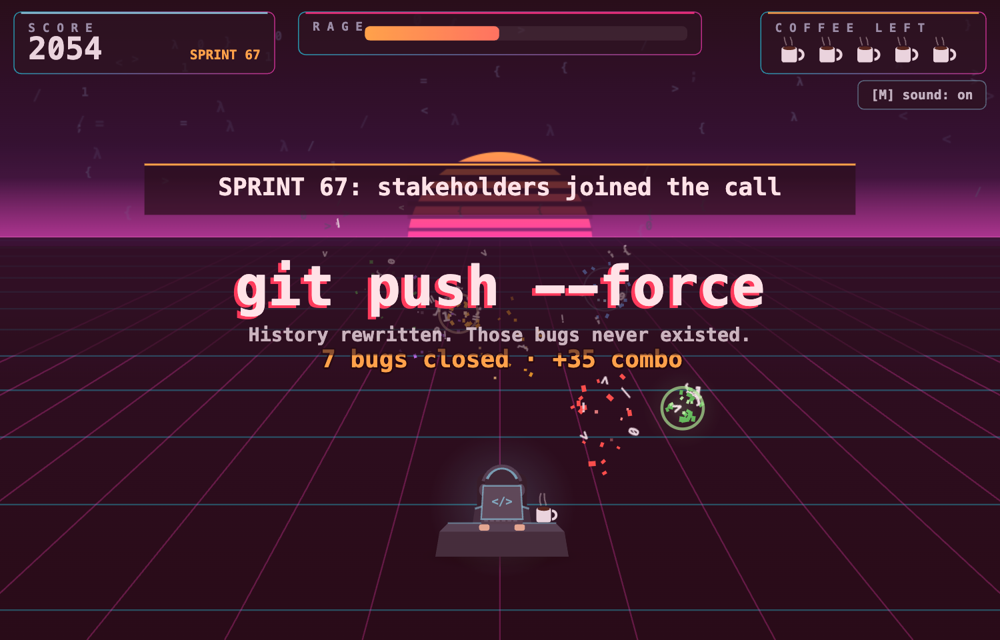
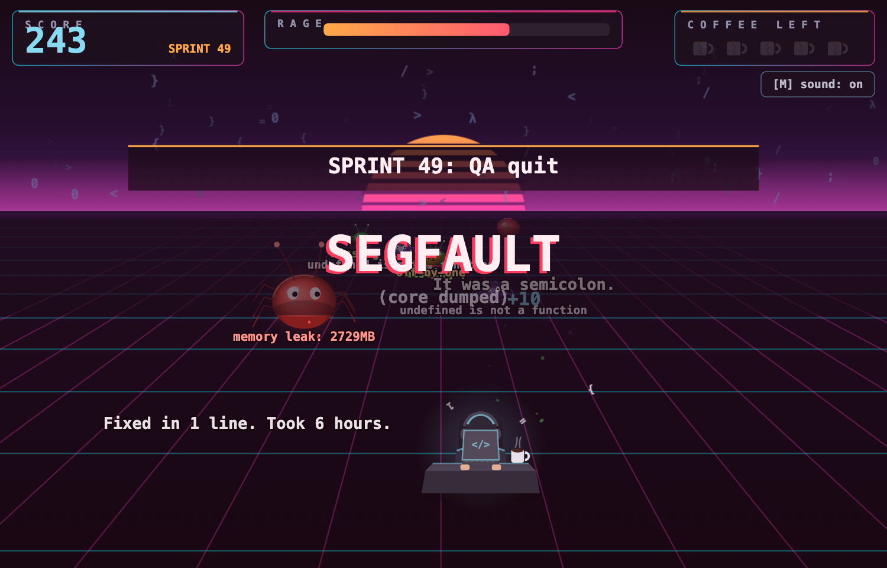
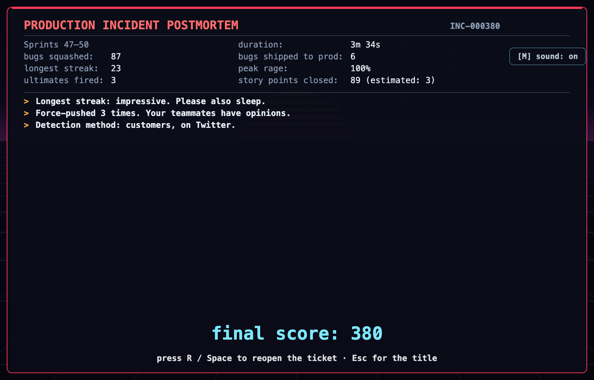
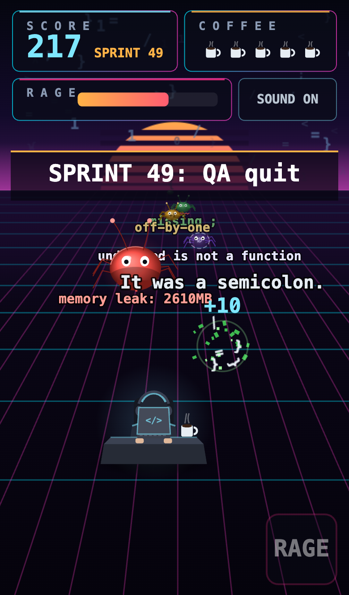
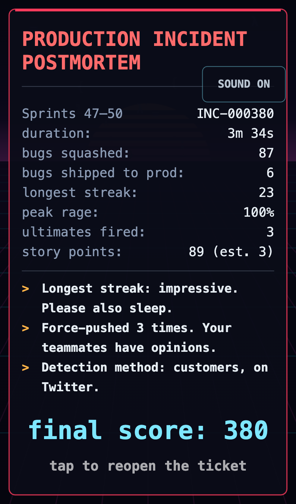
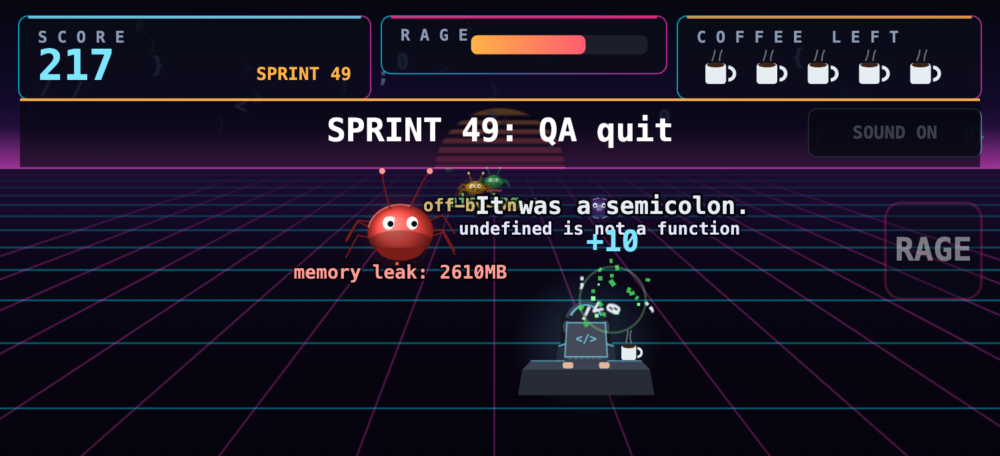

<p align="center">
  
</p>

<p align="center">
  
  
  
  
  
  
  
</p>

<p align="center">
  <b>A synthwave shooter for developers with a deadline.</b><br>
  It's Sprint 47. The build is red. You are the CI. 🧑‍💻 ☕ 🔥
</p>

You're a developer at your desk: hoodie on, headphones in, laptop glowing, coffee within reach. Down a neon corridor come the bugs, tiny at the horizon and very large by the time they reach you. `missing ;`. `undefined is not a function`. A `memory leak` with a live MB counter. A `works on my machine` in sunglasses. Every one you miss ships to production and costs you a coffee. Run out of coffee and you get a **Production Incident Postmortem**, with story points.

Canvas 2D, pseudo-3D, Web Audio synth. Zero runtime dependencies, zero asset files. Everything on screen and in your ears is generated at runtime, like the bugs.

<p align="center">
  
  <br><sub>🔥 Kill streak → RAGE full → <code>Ctrl+Z x1000</code>. Undo. Undo. UNDO. 18 bugs closed.</sub>
</p>

## 📸 Screenshots

<p align="center">
  
  <br><sub>Sprint 49. QA quit. The quips are load-bearing.</sub>
</p>

<table>
  <tr>
    <td align="center"><br><sub>🎮 Title. Bugs drift by while you consider your life choices.</sub></td>
    <td align="center"><br><sub>🔥 RAGE full. <code>git push --force</code>. 7 bugs closed.</sub></td>
  </tr>
  <tr>
    <td align="center"><br><sub>💥 Out of coffee. <code>SEGFAULT (core dumped)</code>.</sub></td>
    <td align="center"><br><sub>📋 The postmortem. Story points closed: 89 (estimated: 3).</sub></td>
  </tr>
</table>

<table>
  <tr>
    <td align="center"><br><sub>📱 Portrait: stacked HUD, a thumb band, a big RAGE button.</sub></td>
    <td align="center"><br><sub>📱 Incidents now fit in your pocket.</sub></td>
    <td align="center"><br><sub>📱 Landscape: full-bleed corridor, aim with your finger.</sub></td>
  </tr>
</table>

## 🚀 Quick start

```sh
npm install
npm run dev        # http://localhost:5173  — the sprint starts now
```

There's no hosted version. It runs on your machine, which, as we all know, is the only machine that matters. To play on your phone, run `npm run dev -- --host` and open the LAN address Vite prints.

## ⌨️ Controls

| Action | 🖥️ Desktop | 📱 Mobile |
| --- | --- | --- |
| Move | <kbd>←</kbd> <kbd>→</kbd> or <kbd>A</kbd> <kbd>D</kbd> | Drag anywhere |
| Aim | Mouse | Your finger's column |
| Shoot | Click or <kbd>Space</kbd> | Auto-fires while touching |
| Unleash RAGE (when full) | <kbd>Shift</kbd> or <kbd>E</kbd> | Tap **RAGE**, or two-finger tap |
| Mute | <kbd>M</kbd> (remembered between visits) | Tap **SOUND** |
| Reopen the ticket after a postmortem | <kbd>R</kbd> or <kbd>Space</kbd>, <kbd>Esc</kbd> for the title | Tap |

## 🐛 Bug bestiary

Bugs unlock as your score climbs. Each new kind arrives with a `NEW BUG UNLOCKED` banner and unsolicited advice.

| | Error label | Behavior | HP · pts | Notes from the team |
| --- | --- | --- | --- | --- |
| 🟢 | `missing ;` | Wobbles straight at you. The junior of bugs. Comes with its own red squiggle. | 1 · 10 | "Prettier would've caught that." |
| 🟣 | `undefined is not a function` | Slow, wide wobble; flips its label to `null` when you're not looking. | 1 · 15 | "Billion-dollar mistake, ten-point kill." |
| 🟡 | `off-by-one` | Marches in steps. Killing it spawns exactly one more. | 1 · 20 | "Arrays start at 0. Mostly." |
| 🔴 | `memory leak` | Grows the longer you ignore it, MB counter and all. Like tech debt. | 3 · 40+ | "Restarted the pod. Root cause: unknown." |
| 🔵 | `race condition` | Jitters, teleports, sometimes reads `condition race`. Can't be reproduced. Try anyway. | 1 · 30 | "Just add a sleep(100). Fixed." |
| 🕶️ | `works on my machine` | Wears sunglasses. Shrugs off the first hit: `¯\_(ツ)_/¯` `can't repro`. | 2 · 35 | "Your machine is a liar." |

## 🔥 RAGE and ultimates

Every bug that ships to production fills the **RAGE** meter. When it's full the game starts nagging ("The meter is full. Like your inbox.") until you press <kbd>Shift</kbd>. Then one of these goes off:

| Ultimate | What happens | Tagline |
| --- | --- | --- |
| `git push --force` | Every bug on screen detonates, in sequence | History rewritten. Those bugs never existed. |
| `rm -rf node_modules` | Every bug shrinks to nothing | 1.2 GB freed. Bugs included. |
| `sudo !!` | Re-runs the previous ultimate, with privilege | With great power comes zero code review. |
| `Ctrl+Z x1000` | Bugs rewind back into the horizon | Undo. Undo. UNDO. |
| `kill -9` | Wipe. No SIGTERM first. | No graceful shutdown for you. |
| `DROP TABLE bugs;` | Wipe, with a green flash | Little Bobby Tables sends his regards. |

## 📈 Sprints, streaks, and the inevitable postmortem

- **Sprints.** Every 100 points is a new sprint: faster spawns, faster bugs, nastier kinds. Each one gets a banner: `SPRINT 49: QA quit`, `SPRINT 52: the retro changed nothing`, `SPRINT 55: stakeholders joined the call`.
- **Streaks.** 5 kills: *"Pairing with yourself."* 10: *"10x developer."* 20: *"Promoted to Staff. No raise."* 30: *"Tech lead. Now you attend meetings."* 50: *"Legend. HR would like a word."*
- **Coffee.** ☕☕☕☕☕ Five of them. Lose them all and it's `SEGFAULT (core dumped)`, then the **Production Incident Postmortem**: duration, bugs squashed, bugs shipped to prod, longest streak, peak rage, ultimates fired, and story points closed, which are always a Fibonacci number because it's the law. Verdicts are data-driven: *"More bugs shipped than fixed. Promoted to management."* *"Rage meter full, never used. Passive-aggressive, classic."*

## 🎧 Sound

All synthesized with Web Audio: a pew per shot, a squish pitched per bug kind, an error buzz when one ships, a rising arpeggio when RAGE is ready, a keyboard-mash ultimate, a sad trombone for the postmortem, and a synthwave loop that speeds up every sprint. No audio files were harmed. <kbd>M</kbd> mutes, and it remembers.

<details>
<summary><b>🔧 How it works</b> (the part the PM skips)</summary>

- **Pseudo-3D.** Entities live in world coordinates: `lane` in [-1, 1] across the corridor and `z` in [0, 1] from horizon to desk. `src/render/projection.ts` maps those to screen position and scale with a true perspective ratio, so bugs accelerate toward the camera and bullets shrink into the vanishing point. Collision runs in projected screen space with a depth tolerance, so a near bullet can't hit a far bug it merely overlaps.
- **Desktop vs mobile.** Desktop renders a fixed 960x540 logical canvas, letterboxed. On coarse-pointer devices or windows under 700px on the short side, `src/render/viewport.ts` switches to a fluid mode: the canvas is the page, logical units equal CSS pixels, and separate `ui` and `world` scales size the HUD and the entities. Portrait raises the horizon to make room for a stacked HUD and a thumb band with the RAGE button. Rotation re-lays everything out live.
- **No assets.** Sprites are drawn to offscreen canvases once and cached; audio is oscillators and filtered noise through Web Audio. `public/assets/` is intentionally empty, as a statement.

```
index.html              # canvas + control hints
src/
  main.ts               # boots the title scene; dev-only window.__bb inspection hook
  engine/               # game loop, input (keys/mouse/touch), scene interface, Web Audio synth
  render/               # projection, corridor, sprite cache, bug/dev art, HUD, camera shake, viewport
  fx/                   # particle pool, floating text, effects facade
  content/              # bug kinds + difficulty, quips, ultimates
  systems/              # rage meter, run stats (Fibonacci story points)
  entities/             # player, bug, bullet
  scenes/               # title, play, game over (postmortem)
docs/                   # README banner, GIF and screenshots
```

```sh
npm run build      # tsc + vite build
npm run typecheck  # tsc --noEmit
npm run preview    # serve the production build
```

</details>

## 🗂️ Roadmap (BB board)

| Key | Summary | Status | Points |
| --- | --- | --- | --- |
| BB-1 | Pseudo-3D corridor, shaded sprites, particles, screen shake | ✅ Done | 13 |
| BB-2 | Synthesized SFX and music | ✅ Done | 8 |
| BB-3 | Six bug kinds with distinct behavior | ✅ Done | 8 |
| BB-4 | Sprints and difficulty ramp | ✅ Done | 3 |
| BB-5 | RAGE meter and ultimates | ✅ Done | 5 |
| BB-6 | Mobile: fluid layout, touch aim, RAGE button | ✅ Done | 21 (estimated: 3) |
| BB-7 | Power-ups: coffee refill ☕, rubber duck 🦆, linter beam | 📋 Backlog | 5 |
| BB-8 | Boss bug: **the legacy monolith** | 📋 Backlog | nobody will estimate it |
| BB-9 | High score table | 📋 Backlog | 2 |
| BB-10 | Bugs occasionally reach production | ⛔ Won't Fix | working as intended |

## 🧹 Contributing

Open an issue. It will be triaged, labeled `cannot reproduce`, and closed. Then reopened by a customer. PRs welcome; reviews are `LGTM. Merging without reading.`

---

<p align="center"><sub>Made with ☕, 🎧, and an unhealthy relationship with <code>git push --force</code>.<br>
Blameless postmortem. (We're blaming you anyway.)</sub></p>
